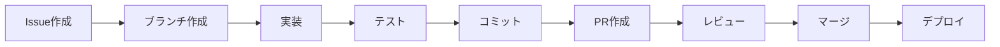

# 開発ワークフロー

## 🔄 基本開発フロー

### 日常的な開発サイクル


### 開発環境の準備
```bash
# 1. 最新のmainブランチを取得
git checkout main
git pull origin main

# 2. 新しい機能ブランチを作成
git checkout -b feature/user-profile

# 3. 開発サーバー起動
pnpm dev

# 4. 別ターミナルでテスト監視
pnpm test --watch
```

## 🌱 ブランチ戦略

### Git Flow Lite
```
main              ← 本番環境（常に安定）
├── feature/auth  ← 新機能開発
├── fix/login-bug ← バグ修正
└── chore/deps    ← 保守作業
```

### ブランチ命名規則
```bash
# 新機能
feature/user-registration
feature/dashboard-analytics

# バグ修正
fix/auth-redirect-loop
fix/api-validation-error

# 保守・改善
chore/update-dependencies
chore/improve-performance

# ドキュメント
docs/api-documentation
docs/setup-guide

# リファクタリング
refactor/auth-service
refactor/component-structure
```

### ブランチ作成・切り替え
```bash
# 機能開発ブランチ作成
git checkout -b feature/shopping-cart

# 既存ブランチに切り替え
git checkout feature/user-profile

# ブランチ一覧確認
git branch -a

# リモートブランチ追跡
git checkout -b feature/payments origin/feature/payments
```

## 💻 実装フロー

### 1. 要件分析
```markdown
## 実装前チェックリスト
- [ ] 要件を明確に理解している
- [ ] UI/UXデザインが決まっている
- [ ] APIエンドポイント設計完了
- [ ] データベーススキーマ設計完了
- [ ] テストケース考慮済み
```

### 2. 設計・実装順序
```bash
# 推奨実装順序
1. データベーススキーマ（Supabase）
2. TypeScript型定義
3. API Routes（バックエンド）
4. ユニットテスト
5. UIコンポーネント（フロントエンド）
6. 統合・E2Eテスト
```

### 3. コード実装
```typescript
// 実装例: ユーザープロフィール機能

// 1. 型定義 (types/user.ts)
export interface UserProfile {
  id: string
  name: string
  email: string
  avatar?: string
  bio?: string
  created_at: string
  updated_at: string
}

// 2. バリデーション (lib/validations.ts)
export const userProfileSchema = z.object({
  name: z.string().min(1).max(100),
  bio: z.string().max(500).optional(),
})

// 3. API Route (app/api/user/profile/route.ts)
export async function PUT(request: NextRequest) {
  const session = await requireAuth(request)
  const body = await request.json()
  const validatedData = userProfileSchema.parse(body)
  
  // Supabase更新処理
}

// 4. コンポーネント (components/user-profile-form.tsx)
export function UserProfileForm({ user }: { user: UserProfile }) {
  const { register, handleSubmit } = useForm()
  // フォーム実装
}
```

## 🧪 テスト統合ワークフロー

### テスト実行順序
```bash
# 1. 型チェック
pnpm type-check

# 2. リンター
pnpm lint

# 3. ユニットテスト
pnpm test

# 4. ビルドテスト
pnpm build

# 5. E2Eテスト
pnpm test:e2e
```

### テスト駆動開発（TDD）
```bash
# Red: 失敗するテストを書く
echo "test('should create user profile', async () => {
  const result = await createUserProfile({ name: 'John' })
  expect(result.name).toBe('John')
})" > __tests__/user-profile.test.ts

# Green: テストを通すコードを書く
# Refactor: コードを改善
```

### テストカバレッジ確認
```bash
# カバレッジレポート生成
pnpm test --coverage

# カバレッジ目標: 80%以上
```

## 📝 コミット・PR戦略

### コミットメッセージ（Conventional Commits）
```bash
# 基本フォーマット
<type>: <description>

[optional body]

[optional footer]
```

### コミットタイプ
```bash
feat: 新機能追加
fix: バグ修正
docs: ドキュメント変更
style: スタイル変更（機能に影響なし）
refactor: リファクタリング
test: テスト追加・修正
chore: 保守作業
perf: パフォーマンス改善
```

### コミット例
```bash
# 良いコミット例
git commit -m "feat: add user profile edit functionality

- Add profile form with validation
- Implement API endpoint for profile updates
- Add unit tests for profile service
- Update UI components with new design

Closes #123"

# 悪いコミット例
git commit -m "fix stuff"
git commit -m "update code"
```

### プルリクエスト作成
```bash
# 1. ブランチをプッシュ
git push origin feature/user-profile

# 2. GitHub CLI使用（推奨）
gh pr create --title "feat: implement user profile management" \
--body "$(cat <<'EOF'
## Summary
- Add user profile edit functionality
- Implement validation and API endpoints
- Add comprehensive tests

## Test plan
- [ ] Manual testing of profile form
- [ ] API endpoint testing
- [ ] E2E test for complete flow

## Related
- Closes #123
- Related to #124
EOF
)"

# 3. または、GitHub Webインターフェースで作成
```

### PRテンプレート
```markdown
## Summary
<!-- 変更内容の1-3行要約 -->

## Changes
<!-- 具体的な変更点をリスト -->
- [ ] 機能A追加
- [ ] バグB修正
- [ ] テストC追加

## Test plan
<!-- テスト手順・確認項目 -->
- [ ] ユニットテスト実行
- [ ] 手動テスト実行
- [ ] E2Eテスト実行

## Screenshots/Demo
<!-- UI変更がある場合 -->

## Related Issues
<!-- 関連Issue -->
- Closes #123
- Related to #124

## Deployment Notes
<!-- デプロイ時の注意事項があれば -->
```

## 🔍 コードレビュー

### レビュー観点
```markdown
### セキュリティ
- [ ] 認証・認可チェック実装済み
- [ ] 入力値バリデーション実装済み
- [ ] SQLインジェクション対策済み
- [ ] XSS対策済み

### パフォーマンス
- [ ] 不要なレンダリングなし
- [ ] 効率的なクエリ設計
- [ ] 適切なキャッシング

### 品質
- [ ] テストカバレッジ十分
- [ ] エラーハンドリング実装済み
- [ ] ログ出力適切
- [ ] ドキュメント更新済み

### UX
- [ ] レスポンシブ対応
- [ ] アクセシビリティ対応
- [ ] ローディング状態表示
- [ ] エラー状態表示
```

### レビューコメント例
```markdown
# 👍 良い点
この実装は型安全性が確保されていて素晴らしいです。

# 🤔 改善提案
パフォーマンス向上のため、useMemoの使用を検討してみてください。

# ❓ 質問
この処理でエラーが発生した場合のユーザー体験はどうなりますか？

# 🚨 必須修正
セキュリティの観点から、入力値バリデーションが必要です。
```

## 🚀 デプロイフロー

### 自動デプロイ（推奨）
```yaml
# GitHub Actions設定例
name: Deploy

on:
  push:
    branches: [main]
  pull_request:
    branches: [main]

jobs:
  deploy:
    runs-on: ubuntu-latest
    steps:
      - uses: actions/checkout@v3
      - uses: pnpm/action-setup@v2
      - name: Install and Build
        run: |
          pnpm install
          pnpm build
      - name: Deploy to Vercel
        uses: amondnet/vercel-action@v20
        with:
          vercel-token: ${{ secrets.VERCEL_TOKEN }}
          vercel-org-id: ${{ secrets.ORG_ID }}
          vercel-project-id: ${{ secrets.PROJECT_ID }}
```

### 手動デプロイ
```bash
# Vercel CLI使用
vercel --prod

# 環境変数確認
vercel env ls

# ログ確認
vercel logs
```

## 🔧 Claude Code 連携ワークフロー

### Claude Code活用シーン
```markdown
## 実装段階での活用
1. **設計相談**: 「この機能のAPI設計について相談したい」
2. **コード生成**: 「ユーザープロフィール機能を実装して」
3. **バグ修正**: 「このエラーを修正して」
4. **リファクタリング**: 「このコードを最適化して」

## レビュー段階での活用
1. **コード品質チェック**: 「このPRをレビューして」
2. **セキュリティ確認**: 「セキュリティの観点でチェックして」
3. **パフォーマンス分析**: 「パフォーマンス改善点を見つけて」

## テスト段階での活用
1. **テストケース生成**: 「この機能のテストを作成して」
2. **E2Eシナリオ**: 「E2Eテストシナリオを考えて」
3. **バグ再現**: 「この問題を再現してテストケース作成して」
```

### Claude Code向けの情報整理
```bash
# 作業前に情報をまとめる
1. 要件・仕様の明確化
2. 既存コードの構造理解
3. 関連ファイルの特定
4. 制約・注意点の整理

# 効果的な依頼方法
「○○機能を実装したいです。
- 要件: △△△
- 制約: □□□
- 既存の□□□との連携が必要
- セキュリティ面で○○○に注意」
```

## 📋 開発チェックリスト

### 機能実装完了チェック
```markdown
- [ ] 要件通りに実装完了
- [ ] TypeScript型安全性確保
- [ ] エラーハンドリング実装
- [ ] ユニットテスト作成（80%以上カバレッジ）
- [ ] E2Eテスト作成
- [ ] セキュリティ対策実装
- [ ] パフォーマンス最適化
- [ ] アクセシビリティ対応
- [ ] レスポンシブ対応
- [ ] ドキュメント更新
```

### リリース前チェック
```markdown
- [ ] 全テスト通過
- [ ] ビルド成功
- [ ] 環境変数設定確認
- [ ] データベースマイグレーション実行
- [ ] パフォーマンステスト実行
- [ ] セキュリティスキャン実行
- [ ] ステージング環境での動作確認
- [ ] ロールバック手順確認
```

## 🐛 トラブルシューティング

### よくある問題と解決法
```bash
# Git関連
## ブランチ間での変更衝突
git checkout main
git pull origin main
git checkout feature/branch
git rebase main

## コミット取り消し
git reset --soft HEAD~1  # コミット取り消し（変更は保持）
git reset --hard HEAD~1  # コミット・変更完全削除

# 開発環境関連
## ポート競合
lsof -ti:3000 | xargs kill -9

## 依存関係問題
rm -rf node_modules .next
pnpm install

## TypeScript型エラー
pnpm type-check
# エラー内容に応じて型定義修正

# テスト関連
## テスト失敗時のデバッグ
pnpm test --reporter=verbose
pnpm test:e2e --headed  # ブラウザ表示でE2Eテスト実行
```

### ログ・デバッグ情報
```typescript
// 開発時のデバッグログ
if (process.env.NODE_ENV === 'development') {
  console.log('Debug info:', data)
}

// エラー追跡
console.error('Error occurred:', error, {
  context: 'user-profile-update',
  userId: session.user.id,
  timestamp: new Date().toISOString()
})
```