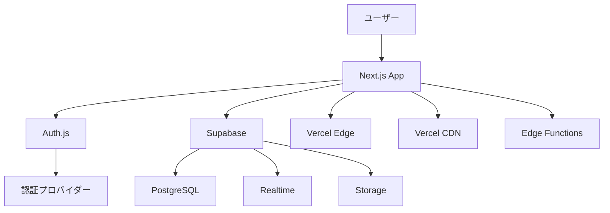
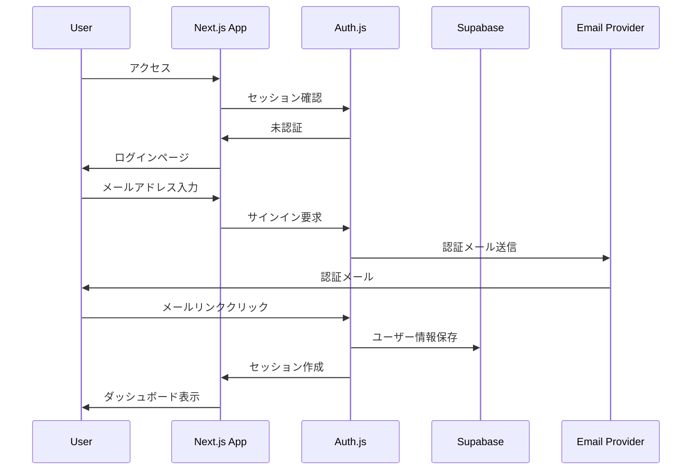

# システムアーキテクチャ

## 🏗 全体構成



## 🚀 アプリケーション層

### フロントエンド（Next.js）

#### App Router構成
```
src/app/
├── (auth)/              # 認証関連ルート
│   └── login/           # ログインページ
├── dashboard/           # ダッシュボード
├── items/              # データ管理
│   ├── page.tsx        # 一覧
│   ├── new/            # 新規作成
│   └── [id]/           # 詳細・編集
├── api/                # API Routes
│   ├── auth/           # 認証API
│   └── items/          # データAPI
├── globals.css         # グローバルスタイル
├── layout.tsx          # ルートレイアウト
└── page.tsx           # トップページ
```

#### Server vs Client Components
```typescript
// Server Component（デフォルト）
// - データフェッチ
// - SEO最適化
// - 初期レンダリング高速化
async function ItemList() {
  const items = await fetchItems()
  return <ItemListClient items={items} />
}

// Client Component（必要時のみ）
// - インタラクション
// - ブラウザAPI使用
// - 状態管理
'use client'
function ItemListClient({ items }: { items: Item[] }) {
  const [filter, setFilter] = useState('')
  // ...
}
```

### API層（Route Handlers）

#### RESTful API設計
```typescript
// app/api/items/route.ts
import { NextRequest, NextResponse } from 'next/server'
import { getServerSession } from 'next-auth'

// GET /api/items - 一覧取得
export async function GET(request: NextRequest) {
  const session = await getServerSession(authOptions)
  if (!session) return new Response('Unauthorized', { status: 401 })
  
  const { searchParams } = new URL(request.url)
  const page = parseInt(searchParams.get('page') || '1')
  const limit = parseInt(searchParams.get('limit') || '10')
  
  // Supabaseクエリ
  const { data, error } = await supabase
    .from('items')
    .select('*')
    .range((page - 1) * limit, page * limit - 1)
    .order('created_at', { ascending: false })
  
  if (error) {
    return NextResponse.json({ error: error.message }, { status: 500 })
  }
  
  return NextResponse.json({ data, page, limit })
}

// POST /api/items - 新規作成
export async function POST(request: NextRequest) {
  const session = await getServerSession(authOptions)
  if (!session) return new Response('Unauthorized', { status: 401 })
  
  try {
    const body = await request.json()
    const validatedData = itemSchema.parse(body)
    
    const { data, error } = await supabase
      .from('items')
      .insert({
        ...validatedData,
        created_by: session.user.id,
        updated_by: session.user.id,
      })
      .select()
      .single()
    
    if (error) throw error
    
    return NextResponse.json({ data }, { status: 201 })
  } catch (error) {
    if (error instanceof z.ZodError) {
      return NextResponse.json(
        { error: 'Validation error', details: error.errors },
        { status: 400 }
      )
    }
    return NextResponse.json(
      { error: 'Internal server error' },
      { status: 500 }
    )
  }
}
```

#### エラーハンドリング戦略
```typescript
// lib/api-error.ts
export class ApiError extends Error {
  constructor(
    public statusCode: number,
    message: string,
    public code?: string
  ) {
    super(message)
    this.name = 'ApiError'
  }
}

// 統一エラーハンドラー
export function handleApiError(error: unknown): NextResponse {
  console.error('API Error:', error)
  
  if (error instanceof ApiError) {
    return NextResponse.json(
      { error: error.message, code: error.code },
      { status: error.statusCode }
    )
  }
  
  if (error instanceof z.ZodError) {
    return NextResponse.json(
      { error: 'Validation error', details: error.errors },
      { status: 400 }
    )
  }
  
  return NextResponse.json(
    { error: 'Internal server error' },
    { status: 500 }
  )
}
```

## 🔐 認証・認可層

### Auth.js設定
```typescript
// lib/auth.ts
import { NextAuthOptions } from 'next-auth'
import { SupabaseAdapter } from '@auth/supabase-adapter'
import EmailProvider from 'next-auth/providers/email'

export const authOptions: NextAuthOptions = {
  adapter: SupabaseAdapter({
    url: process.env.NEXT_PUBLIC_SUPABASE_URL!,
    secret: process.env.SUPABASE_SERVICE_ROLE_KEY!,
  }),
  
  providers: [
    EmailProvider({
      server: {
        host: process.env.EMAIL_SERVER_HOST,
        port: process.env.EMAIL_SERVER_PORT,
        auth: {
          user: process.env.EMAIL_SERVER_USER,
          pass: process.env.EMAIL_SERVER_PASSWORD,
        },
      },
      from: process.env.EMAIL_FROM,
    }),
  ],
  
  session: {
    strategy: 'jwt',
    maxAge: 30 * 24 * 60 * 60, // 30日
  },
  
  callbacks: {
    session: async ({ session, token }) => {
      if (token && session.user) {
        session.user.id = token.sub!
      }
      return session
    },
    jwt: async ({ token, user }) => {
      if (user) {
        token.sub = user.id
      }
      return token
    },
  },
  
  pages: {
    signIn: '/login',
    verifyRequest: '/verify-request',
    error: '/auth/error',
  },
  
  events: {
    async signIn({ user, isNewUser }) {
      if (isNewUser) {
        // 新規ユーザーの初期設定
        await initializeNewUser(user.id)
      }
    },
  },
}
```

### 認証フロー


## 🗄 データ層

### Supabase Architecture
```typescript
// lib/supabase.ts
import { createClient } from '@supabase/supabase-js'
import { Database } from '@/types/database'

// Client-side用（公開キー）
export const supabase = createClient<Database>(
  process.env.NEXT_PUBLIC_SUPABASE_URL!,
  process.env.NEXT_PUBLIC_SUPABASE_ANON_KEY!
)

// Server-side用（管理キー）
export const supabaseAdmin = createClient<Database>(
  process.env.NEXT_PUBLIC_SUPABASE_URL!,
  process.env.SUPABASE_SERVICE_ROLE_KEY!,
  {
    auth: {
      autoRefreshToken: false,
      persistSession: false
    }
  }
)

// RLS対応のクライアント作成
export function createServerSupabaseClient(serverSession: any) {
  return createClient<Database>(
    process.env.NEXT_PUBLIC_SUPABASE_URL!,
    process.env.NEXT_PUBLIC_SUPABASE_ANON_KEY!,
    {
      global: {
        headers: {
          Authorization: `Bearer ${serverSession?.access_token}`,
        },
      },
    }
  )
}
```

### データアクセスパターン
```typescript
// Server Component でのデータフェッチ
async function ItemsPage() {
  const session = await getServerSession(authOptions)
  if (!session) redirect('/login')
  
  // サーバーサイドでデータ取得
  const { data: items } = await supabaseAdmin
    .from('items')
    .select('*')
    .eq('created_by', session.user.id)
    .order('created_at', { ascending: false })
  
  return <ItemsList items={items || []} />
}

// Client Component でのリアルタイム更新
'use client'
function ItemsList({ items: initialItems }: { items: Item[] }) {
  const [items, setItems] = useState(initialItems)
  
  useEffect(() => {
    const channel = supabase
      .channel('items-changes')
      .on('postgres_changes', {
        event: '*',
        schema: 'public',
        table: 'items'
      }, (payload) => {
        // リアルタイム更新処理
        handleRealtimeUpdate(payload)
      })
      .subscribe()
    
    return () => {
      supabase.removeChannel(channel)
    }
  }, [])
  
  return (
    <div>
      {items.map(item => (
        <ItemCard key={item.id} item={item} />
      ))}
    </div>
  )
}
```

## 🎨 UI/UX層

### Component階層
```
components/
├── ui/                 # shadcn/ui基本コンポーネント
│   ├── button.tsx
│   ├── input.tsx
│   ├── card.tsx
│   └── ...
├── layout/            # レイアウト関連
│   ├── header.tsx
│   ├── sidebar.tsx
│   └── footer.tsx
├── forms/             # フォーム関連
│   ├── item-form.tsx
│   └── search-form.tsx
├── data-display/      # データ表示
│   ├── item-card.tsx
│   ├── item-list.tsx
│   └── data-table.tsx
└── providers/         # コンテキストプロバイダー
    ├── auth-provider.tsx
    └── theme-provider.tsx
```

### 状態管理戦略
```typescript
// サーバー状態: Supabase + React Query
import { useQuery, useMutation, useQueryClient } from '@tanstack/react-query'

function useItems() {
  return useQuery({
    queryKey: ['items'],
    queryFn: async () => {
      const { data } = await supabase
        .from('items')
        .select('*')
        .order('created_at', { ascending: false })
      return data
    }
  })
}

function useCreateItem() {
  const queryClient = useQueryClient()
  
  return useMutation({
    mutationFn: async (newItem: CreateItemData) => {
      const { data } = await supabase
        .from('items')
        .insert(newItem)
        .select()
        .single()
      return data
    },
    onSuccess: () => {
      queryClient.invalidateQueries({ queryKey: ['items'] })
    }
  })
}

// クライアント状態: useState/useReducer
function ItemForm() {
  const [formData, setFormData] = useState<CreateItemData>({
    name: '',
    description: ''
  })
  
  // フォーム状態管理
}

// グローバル状態: Jotai（必要時のみ）
import { atom, useAtom } from 'jotai'

const sidebarOpenAtom = atom(false)
const themeAtom = atom<'light' | 'dark'>('light')

function useSidebar() {
  return useAtom(sidebarOpenAtom)
}
```

## 🚀 デプロイ・インフラ

### Vercel デプロイ構成
```javascript
// vercel.json
{
  "framework": "nextjs",
  "buildCommand": "pnpm build",
  "outputDirectory": ".next",
  "installCommand": "pnpm install",
  "functions": {
    "app/api/**/*.ts": {
      "maxDuration": 30
    }
  },
  "headers": [
    {
      "source": "/(.*)",
      "headers": [
        {
          "key": "X-Frame-Options",
          "value": "DENY"
        }
      ]
    }
  ]
}
```

### 環境別設定
```typescript
// lib/env.ts
const environment = process.env.NODE_ENV || 'development'

export const config = {
  development: {
    logLevel: 'debug',
    enableDevTools: true,
    apiTimeout: 30000,
  },
  production: {
    logLevel: 'error',
    enableDevTools: false,
    apiTimeout: 10000,
  },
  test: {
    logLevel: 'silent',
    enableDevTools: false,
    apiTimeout: 5000,
  }
}[environment]
```

## 📊 監視・ログ

### パフォーマンス監視
```typescript
// lib/analytics.ts
import { Analytics } from '@vercel/analytics/react'

// Web Vitals追跡
export function reportWebVitals(metric: any) {
  console.log(metric)
  
  // 本番環境では外部サービスに送信
  if (process.env.NODE_ENV === 'production') {
    // Vercel Analytics, Google Analytics等
  }
}

// カスタムイベント追跡
export function trackEvent(event: string, properties?: Record<string, any>) {
  if (process.env.NODE_ENV === 'production') {
    // イベント送信
  }
}
```

### エラー監視
```typescript
// lib/error-tracking.ts
export function captureException(error: Error, context?: any) {
  console.error('Application Error:', error, context)
  
  if (process.env.NODE_ENV === 'production') {
    // Sentry等にエラー送信
  }
}

// React Error Boundary
class ErrorBoundary extends Component {
  componentDidCatch(error: Error, errorInfo: any) {
    captureException(error, errorInfo)
  }
  
  render() {
    if (this.state.hasError) {
      return <ErrorFallback />
    }
    
    return this.props.children
  }
}
```

## 🔄 開発フロー

### 機能開発パターン
1. **設計**: 要件定義・技術選定
2. **データ設計**: テーブル・API設計
3. **バックエンド実装**: API Routes・RLS
4. **フロントエンド実装**: UI・状態管理
5. **テスト**: 単体・統合・E2E
6. **デプロイ**: ステージング・本番

### CI/CD Pipeline
```yaml
# .github/workflows/ci.yml
name: CI/CD Pipeline

on:
  push:
    branches: [main, develop]
  pull_request:
    branches: [main]

jobs:
  test:
    runs-on: ubuntu-latest
    steps:
      - uses: actions/checkout@v3
      - uses: pnpm/action-setup@v2
      - name: Install dependencies
        run: pnpm install
      - name: Type check
        run: pnpm type-check
      - name: Lint
        run: pnpm lint
      - name: Unit test
        run: pnpm test
      - name: Build
        run: pnpm build
      - name: E2E test
        run: pnpm test:e2e
```